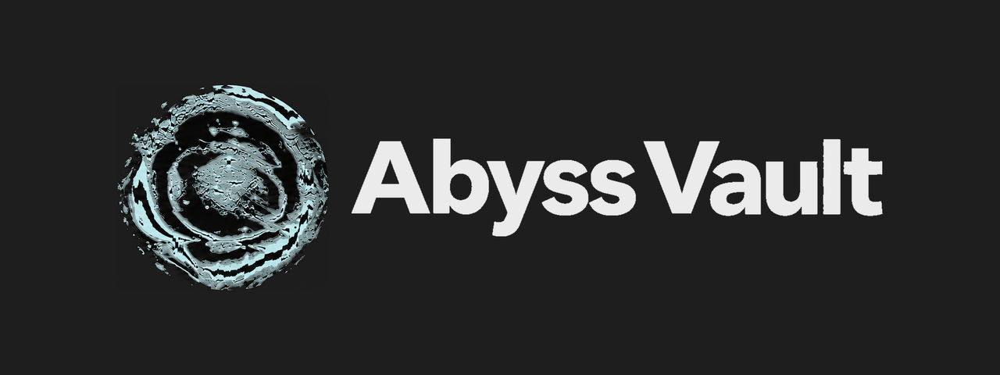
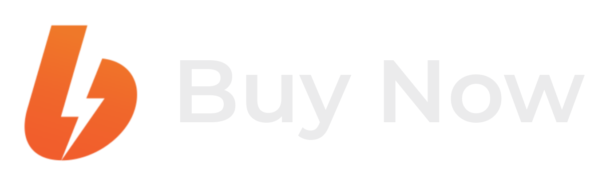
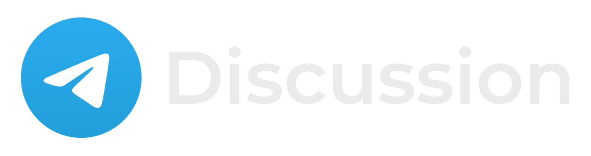
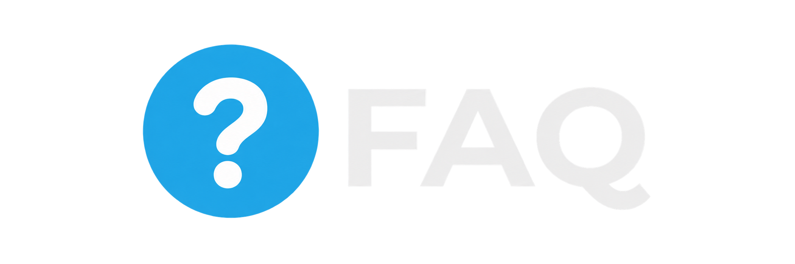
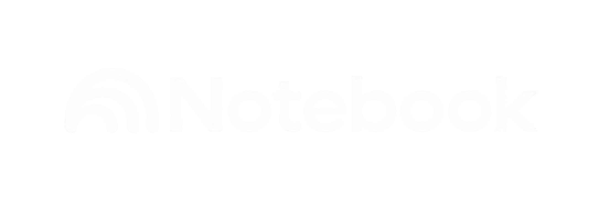

---
tags:
  - status/published
  - project/single
  - priority/normal
  - category/public
  - category/knowledge_base
aliases:
  - Obsidian Vault
  - Хранилище в Obsidian
description: Профессиональный Obsidian Vault с гибридной структурой, интеграцией Zotero и Anki, системой GTD и 12-часовой видеоинструкцией.
published: 2025-02-10
addition:
status: 📢
priority: ◽
category:
  - "[[knowledge base]]"
  - "[[public]]"
meta:
  - "[[obsidian]]"
problem:
creator:
  - "[[Me]]"
production:
  - "[[Boosty]]"
  - "[[flowing-abyss.com]]"
  - "[[Telegram]]"
  - "[[YouTube]]"
start: 2025-08-17
end: 2025-08-17
url:
  - "[Boosty](https://boosty.to/flowing-abyss/posts/c2e3d43f-c2bc-44e1-b771-77244a8cc8ee)"
  - "[flowing-abyss](https://flowing-abyss.com/Description-of-Obsidian-Vault)"
  - "[Telegram](https://t.me/flowing_abyss/66)"
  - "[YouTube](https://youtu.be/4wB-Ph5XYV0)"
cover: "[[Description of Obsidian Vault - cover.jpg]]"
icon: ✏️
color: "#b87535"
created: 2025-08-17T10:54:15+07:00
updated: 2026-09-30T19:28:25+07:00
title: Abyss Vault
share: true
comments: false
enableToc: false
cssclasses:
  - no-inline-title
  - hide-backlinks
---

%%
[[abyss-vault.png]]
[[abyss vault - logo.png]]
[[boosty_buy_now.png]]
[[boosty-icon.png]]
[[github-icon.png]]
[[telegram_discussion.png]]
[[new_changelog.png]]
[[obsidian-icon.png]]
[[faq-icon.png]]
[[NotebookLM-icon.png]]
[[Obsidian Vault - FAQ]]
___
[[obsidian vault - index.png]]
[[obsidian vault - contacts.png]]
[[obsidian vault - dynamic grouping.png]]
[[obsidian vault - hierarchy.png]]
[[obsidian vault - note.png]]
[[obsidian vault - panels.png]]
[[obsidian vault - projects.png]]
[[obsidian vault - quick switcher.png]]
[[obsidian vault - sorting tasks.png]]
[[obsidian vault - sources.png]]
[[obsidian vault - structure.png]]
[[obsidian vault - task calendar.png]]
[[obsidian vault - vault statistics.png]]
[[obsidian vault - calendar.png]]
%%

	
	
	
	
	

<h1 id="описание" class="abyss-section-title" data-heading="Описание" style="display: block; box-sizing: border-box; margin: 1.9em 0 0.8em; padding: 0 0 0 0.65em; border: 0; border-left: 3px solid #a8cdd2; border-radius: 0; background: none; box-shadow: none; color: inherit; font-family: 'IBM Plex Sans', -apple-system, BlinkMacSystemFont, 'Segoe UI', sans-serif; font-size: 1.35em; font-weight: 600; font-style: normal; font-variant: normal; line-height: 1.3; letter-spacing: 0; text-align: left; text-transform: none; white-space: normal;">Описание</h1>

<u>Abyss Vault</u> – это система и среда для тех, кто много учится, исследует и делает проекты. Главная мощь хранилища в глубокой интеграции. Единая логика связывает знания с источниками, задачами, людьми и проектами. Это помогает разбирать сложные темы и использовать накопленное в решении новых проблем.

<h2 id="особенности" class="abyss-section-title" data-heading="Особенности" style="display: block; box-sizing: border-box; margin: 1.6em 0 0.8em; padding: 0 0 0 0.65em; border: 0; border-left: 2px solid #7a9ba1; border-radius: 0; background: none; box-shadow: none; color: inherit; font-family: 'IBM Plex Sans', -apple-system, BlinkMacSystemFont, 'Segoe UI', sans-serif; font-size: 1.16em; font-weight: 600; font-style: normal; font-variant: normal; line-height: 1.3; letter-spacing: 0; text-align: left; text-transform: none; white-space: normal;">Особенности</h2>

- <b>Hybrid Structure</b>
	- [[Obsidian Vault - FAQ#Cистемные заметки|Единая логика]] для разных областей знаний на основе [[Obsidian Vault - FAQ#Метаданные и ссылки|метаданных и ссылок]]
	- Перестройка структуры хранилища прямо [на графе](https://github.com/flowing-abyss/obsidian-bases-structure)

- <b>Fast Workflow</b>
	- Быстрое создание заметок через префиксы, шаблоны и горячие углы
	- Триаж драг-н-дропами для разбора и распределения накопившихся заметок
	- Навигация и основные действия с клавиатуры

- <b>Metadata & Automation</b>
	- [Metadata Validator](https://github.com/flowing-abyss/obsidian-metadata-validator) проверяет и автоматически обновляет свойства заметок по манифестам, где описаны допустимые значения и правила
	- Подсказки в интерфейсе объясняют назначение свойств и помогают их заполнять

- <b>Science Stack</b>
	- [Zotlit](https://github.com/aidenlx/zotlit) поддерживает синхронизацию с Zotero и показывает аннотации рядом с заметками по источникам
	- Интервальные повторения через [Spaced Repetition](https://github.com/st3v3nmw/obsidian-spaced-repetition) или [Anki](https://github.com/ObsidianToAnki/Obsidian_to_Anki)
	- [[Obsidian Vault - FAQ#Discourse Graph|Дискурс-граф]] для работы с научно сложными проблемами

- <b>Task Management</b>
	- [GTD](https://habr.com/en/articles/833654/) для личных дел и отдельные задачи для проектов
	- Календарь, канбан, таймлайн и учёт времени в [Abyss Tasks](https://github.com/flowing-abyss/obsidian-abyss-tasks)

- <b>Dynamic Views</b>
	- Таблицы и карточки [Bases](https://help.obsidian.md/bases) с фильтрами и группировками для источников, проектов, людей и заметок

- <b>Longform & Writing</b>
	- [Longform](https://github.com/kevboh/longform) для длинных текстов и сложных проектов с [отслеживанием статусов](https://habr.com/en/articles/789248/)

- <b>AI Workflow</b>
	- [[Obsidian Vault - FAQ#Skills|Скиллы для Claude Code]] помогают ИИ создавать заметки, готовить обзоры и проводить аудит хранилища
	- Изменения, которые ИИ вносит в свойства заметок, проверяются по манифестам хранилища

- <b>Visual Brutalism</b>
	- Базовая инженерная тема [Base16 Default Dark](https://github.com/flowing-abyss/obsidian-base16-default-dark)
	- Тема заточена под глубокую работу с минимумом отвлечений

<h1 id="видеоинструкция" class="abyss-section-title" data-heading="Видеоинструкция" style="display: block; box-sizing: border-box; margin: 1.9em 0 0.8em; padding: 0 0 0 0.65em; border: 0; border-left: 3px solid #a8cdd2; border-radius: 0; background: none; box-shadow: none; color: inherit; font-family: 'IBM Plex Sans', -apple-system, BlinkMacSystemFont, 'Segoe UI', sans-serif; font-size: 1.35em; font-weight: 600; font-style: normal; font-variant: normal; line-height: 1.3; letter-spacing: 0; text-align: left; text-transform: none; white-space: normal;">Видеоинструкция</h1>

Я записал [12-часовое видео](https://youtu.be/4wB-Ph5XYV0), где показал, как строится структура, как добываются заметки, как декомпозируются и развиваются проекты.

Объяснение строится **исключительно на примерах**. Вы увидите, как система адаптируется под разные контексты:
- Студент/Исследователь
	- Структурирование процесса обучения, чтение, аннотирование, Zotero
- Корпорат
	- Управление проектами, дедлайны, декомпозиция
- Инди-разработчик
	- Развитие глубокой структуры через иерархические заметки
	- Балансирование между обучением и проектами

В видео есть таймкоды, так что смотреть всё залпом не нужно. Разберитесь, как создать категорию и источник внутри неё. Добавьте давно запланированную книгу или курс и начните делать заметки. Остальные механики можно освоить попозже.

<h1 id="технические-требования" class="abyss-section-title" data-heading="Технические требования" style="display: block; box-sizing: border-box; margin: 1.9em 0 0.8em; padding: 0 0 0 0.65em; border: 0; border-left: 3px solid #a8cdd2; border-radius: 0; background: none; box-shadow: none; color: inherit; font-family: 'IBM Plex Sans', -apple-system, BlinkMacSystemFont, 'Segoe UI', sans-serif; font-size: 1.35em; font-weight: 600; font-style: normal; font-variant: normal; line-height: 1.3; letter-spacing: 0; text-align: left; text-transform: none; white-space: normal;">Технические требования</h1>

В видео я показываю, насколько далеко можно зайти с Obsidian. По глубине и технической проработке подход значительно превосходит PARA и LYT.

Базовый функционал здесь не разбираю. Если вы пока не знаете, как оформлять заголовки и где у заметки [frontmatter](https://help.obsidian.md/properties), начните с более [простых хранилищ](https://github.com/SoRobby/ObsidianStarterVault). Моё видео от вас не убежит и не протухнет.

	
	
	

