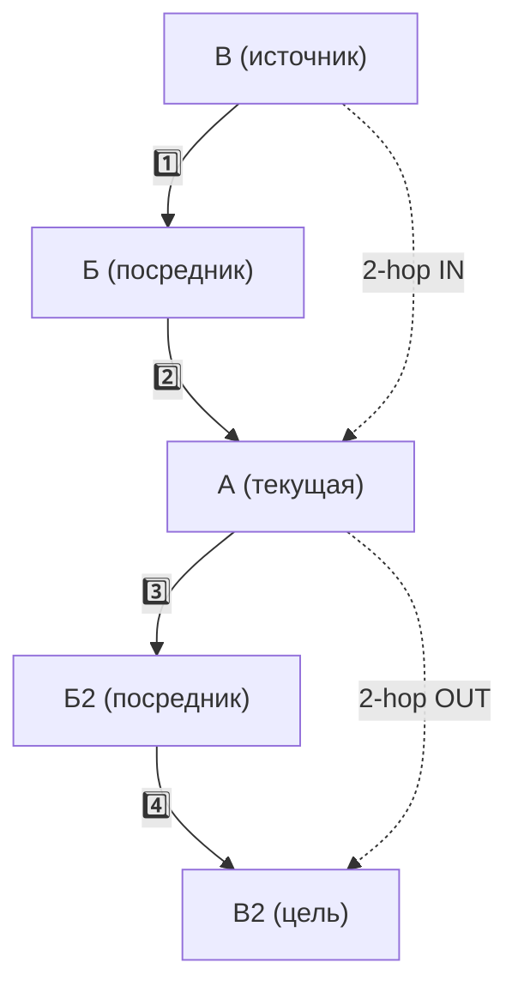

2hop-cсылка – это та, которая связана с текущей заметкой опосредованно (через одну).

На диаграмме пример, где в центре стоит текущая заметка, и показано, какая заметка для текущей будет являться 2hop-заметкой. Как видно, мы учитываем и исходящие, и входящие ссылки: 

Хотя данные ссылки интересно видеть всегда (как обратные ссылки), алгоритмически расчет этих связей довольно затратен. Поэтому я решил сделать отдельное отображение. 